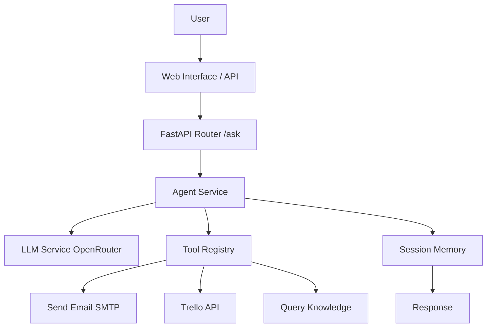

# 🤖 Project 3: AI Agent + Workflow Automation System  
  
  
  
  
  
## 📌 Overview  
  
An **intelligent AI Agent** that automates business operations by integrating with real-world tools (Email, Trello, RAG). The agent understands natural language commands, decides which tools to use, and executes actions in sequence.  
  
### 🎯 Key Features  
  
| Feature | Description |  
|---------|-------------|  
| **7 Real Tools** | Send emails, create Trello tickets, prioritize tasks, summarize conversations, query company knowledge, get time, calculate discounts |  
| **Smart Agent** | Uses LLM (Gemini/Mistral) to decide which tool to use and when |  
| **Memory System** | Stores conversation history per user (last 10 messages) |  
| **Multi-step Execution** | Executes multiple tools in sequence (e.g., email + ticket) |  
| **RAG Integration** | Grounded knowledge base to prevent hallucinations |  
| **Web Interface** | Beautiful Arabic/English chat UI |  
| **Fallback Mechanism** | Automatic fallback between multiple LLM models |  
| **Full Logging** | Complete execution logs for debugging |  
  
---  
  
## 🛠️ Tools Implemented  
  
| Tool | Function | Real/Hybrid |  
|------|----------|--------------|  
| `send_email` | Send real emails via Gmail SMTP | ✅ Real |  
| `create_operational_task` | Create Trello tickets | ✅ Real |  
| `prioritize_tasks` | Prioritize tasks using LLM | ✅ Real |  
| `generate_session_summary` | Summarize conversation using LLM | ✅ Real |  
| `query_knowledge` | Query company knowledge base (RAG) | ✅ Real |  
| `get_current_time` | Get current time in Yemen timezone | ✅ Real |  
| `calculate_discount` | Calculate discounted price | ✅ Real |  
  
---  
  
## 📊 Architecture  
  

---

🚀 Quick Start

Prerequisites

· Python 3.10+
· OpenRouter API Key
· Gmail App Password (for email)
· Trello API Key & Token (for tickets)

Installation

# Clone the repository  
git clone https://github.com/your-username/ai-sentiment-analyzer.git  
cd ai-sentiment-analyzer  
  
# Create virtual environment  
python -m venv venv  
source venv/bin/activate  # On Windows: venv\Scripts\activate  
  
# Install dependencies  
pip install -r requirements.txt  
  
# Set up environment variables  
cp .env.example .env  
# Edit .env with your API keys

Environment Variables (.env)

# Required  
OPENROUTER_API_KEY=your_openrouter_api_key  
  
# Email (SMTP)  
SMTP_SERVER=smtp.gmail.com  
SMTP_PORT=587  
COMPANY_EMAIL=your_email@gmail.com  
EMAIL_PASSWORD=your_app_password  
  
# Trello  
TRELLO_API_KEY=your_trello_api_key  
TRELLO_TOKEN=your_trello_token  
TRELLO_LIST_ID=your_trello_list_id  
  
# Optional (for RAG)  
OPENAI_API_KEY=your_openai_api_key

Run the Server

uvicorn app.main:app --host 0.0.0.0 --port 8000 --reload

Access the Application

· Web Interface: http://localhost:8000/static/index.html
· API Documentation: http://localhost:8000/docs

---

🧪 Testing

Test via Web Interface

Open http://localhost:8000/static/index.html and try these commands:

أرسل ايميل إلى test@gmail.com يقول: مرحباً  
أنشئ تذكرة في Trello: مشكلة تقنية  
رتب هذه المهام: 1- عطل تقني, 2- استفسار عادي  
أعطني ملخصاً للمحادثة

Test via cURL

curl -X POST http://localhost:8000/api/v1/ask \  
  -H "Content-Type: application/json" \  
  -d '{"input": "أرسل ايميل إلى test@gmail.com يقول اختبار"}'

---

📁 Project Structure

ai-sentiment-analyzer/  
├── app/  
│   ├── api/  
│   │   └── routes.py          # API endpoints  
│   ├── services/  
│   │   ├── agent_service.py   # Agent core logic  
│   │   ├── tools.py           # Tool definitions  
│   │   ├── llm_service.py     # OpenRouter integration  
│   │   ├── memory_service.py  # Conversation memory  
│   │   └── vector_service.py  # RAG knowledge base  
│   ├── core/  
│   │   ├── config.py          # Settings manager  
│   │   └── logger.py          # Logging configuration  
│   ├── static/  
│   │   └── index.html         # Web interface  
│   └── main.py                # FastAPI entry point  
├── data/  
│   └── info.txt               # Knowledge base (RAG)  
├── tests/  
│   └── test_api.py            # Unit tests  
├── .env                       # Environment variables  
├── requirements.txt           # Dependencies  
└── README.md                  # This file

---

🔧 API Endpoints

Method Endpoint Description
POST /api/v1/ask Send a command to the agent
POST /api/v1/train Add new knowledge to RAG
GET /api/v1/status Check server status
GET /api/v1/debug/memory View memory contents (debug)

---

🧠 How the Agent Works

sequenceDiagram  
    User->>API: POST /ask {"input": "Send email"}  
    API->>Agent: run_agent(user_prompt)  
    Agent->>Memory: get_history()  
    Agent->>LLM: call_llm(system_instruction + prompt)  
    LLM-->>Agent: tool_calls: send_email  
    Agent->>Tools: execute send_email(to, subject, body)  
    Tools-->>Agent: result: success  
    Agent->>Memory: add_message(user, assistant)  
    Agent-->>API: final response  
    API-->>User: {"ai_response": "Email sent"}

---

🐛 Known Issues & Solutions

Issue Solution
Summary tool shows "لا توجد محادثات" Ensure user_id="web_user" is consistent
Trello creation fails Check API keys and List ID in .env
Email not received Check Spam folder; verify App Password
LLM returns non-JSON _safe_parse() handles this automatically

---

🔄 Comparison with Projects 1 & 2

Aspect Project 1 Project 2 Project 3
Purpose Structured output RAG knowledge Agent automation
LLM Role JSON extractor Answer generator Decision maker
Tools None RAG retrieval 7 real APIs
Memory None None Per-user sessions
Multi-step No No Yes (up to 5 loops)

---

📈 RAG Analysis (12 Core Features)

Feature Implemented Location
Knowledge ✅ data/info.txt
Generator ✅ llm_service.py
Retriever ✅ (basic) query_knowledge()
Grounding ✅ system_instruction
Context Injection ✅ query_knowledge() return
Prompt Design ✅ system_instruction
Embeddings ✅  lanned
Vector Store ✅ Planned
Chunking ✅ Planned
Query Refinement ✅ Planned
Re-ranking ✅ Planned
Evaluation Loop ✅ Planned

Current RAG Level: Basic RAG (50% complete)

---

🚧 Next Steps (Project 4)

· Dockerization of the entire application
· CI/CD pipeline (GitHub Actions)
· Monitoring with Prometheus + Grafana
· Cloud deployment (Render / AWS)
· Cost tracking for LLM API calls

---

📝 System Prompt (Key Rules)

⚡ **Execution Rules** 1. Execute only one tool per request unless multiple tasks explicitly requested  
2. Do not reuse results from previous tools  
3. Do not execute tools not explicitly requested  
4. Do not merge results from multiple tools unless requested  
5. Ignore previous tool results when starting a new request

---

🤝 Contributing

This is a learning project for AI Engineering. Feel free to fork and experiment!

---

📄 License

MIT License

---

🙏 Acknowledgments

· OpenRouter for LLM API access
· Trello for their API
· FastAPI framework
· All open-source libraries used

---

Built with ❤️ as part of AI Engineer Learning Path (2026)